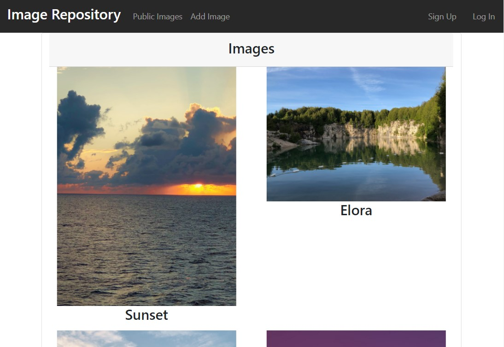
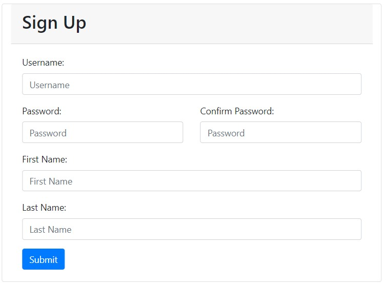
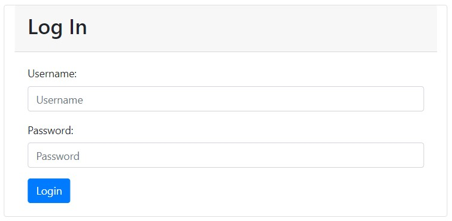
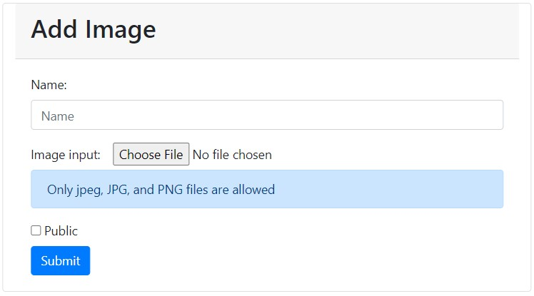
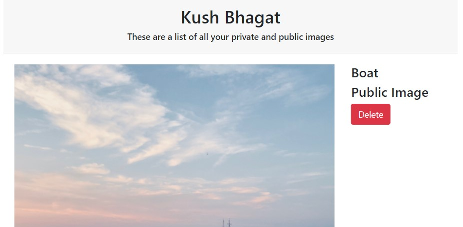

<h1 align="center">💻 Image Repository 💻</h1>
This is the documentation on how to use the Image Repository Web Application.
This web application makes use of a backend server that you can see the source code for
<a href="https://github.com/kushbhag/ImageRepositoryServer">here</a>. If you would like to try this web application out,
feel free to visit <a href="https://kushbhag.github.io/ImageRepository/">here</a>.

---
## Usage
The general concept of this web application is that users can upload private and public iamges similar to a repository.
All public images are shown on the home page (similar to instagram) and will look something like this.

You can also click the individual images to get a zoomed in view of the image, along with details on who submitted it.

### Sign Up
If you would like to post private or public images, then you would need to sign up and create an account.
To navigate to the sign up page just click the sign up button located on the top right of the header.
Once you are there, you will be shown a screen similar to below.

After filling in all the details correctly, your account will be created and you can log in now. All passwords are
encrypted and then stored in the database, therefore nobody has access to your password (not even me).

### Log In
Similar to the sign up page, you will need to fill out the login form to login to your account that you just created.

### Add Images
If you would like to upload a picture, just click the add images button in the header. You should then see the form below.

If you want to make the image public, then you need to make sure the checkbox is checked.

### User Account
If you would like to view your user account, along with a list of all the images (private or public) that you uploaded,
click the "Logged in as ..." button in the header.

You will get a full list of all of your images, along with its corresponding public and name details. If you would also like to delete the
image you can click the delete button located on the side of each image.

---
## Feedback
If you have any ideas on how to improve this application, feel free to contact me!
